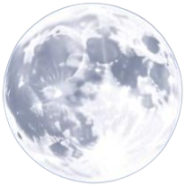
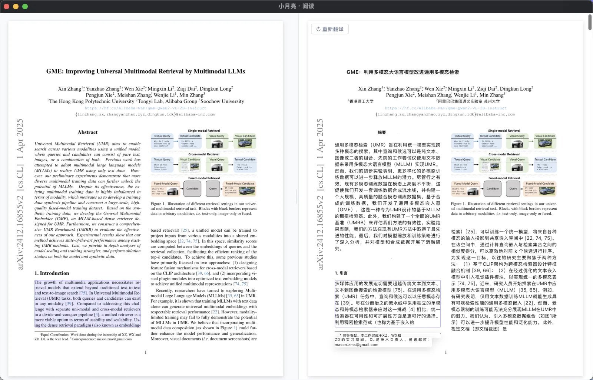
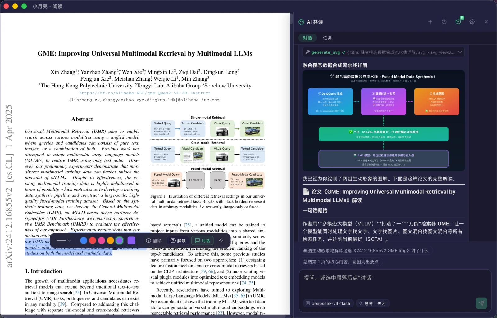
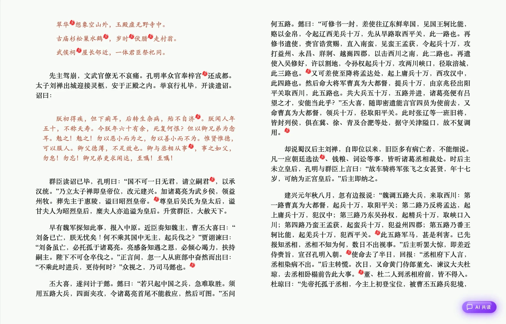

  

<h1 align="center">🌙 小月亮阅读器</h1>

  <strong>Journey Drives Knowledge</strong> 
  <em>ArXiv 顶会论文一键阅读 · 双语对照 · AI 深度解读 · 极致 EPUB 体验</em>

  
  
  
  

 

<!-- 星空动画 Hero（GitHub 支持内联 SVG + SMIL 动画） -->

<svg width="820" height="200" viewBox="0 0 820 200" xmlns="http://www.w3.org/2000/svg" role="img" aria-label="星夜下的阅读器">
  <defs>
    <radialGradient id="moonGlow" cx="50%" cy="50%" r="50%">
      <stop offset="0%" stop-color="#ffe9a8" stop-opacity="0.9"/>
      <stop offset="60%" stop-color="#ffe9a8" stop-opacity="0.25"/>
      <stop offset="100%" stop-color="#ffe9a8" stop-opacity="0"/>
    </radialGradient>
    <linearGradient id="skyGrad" x1="0" y1="0" x2="0" y2="1">
      <stop offset="0%" stop-color="#0a0e24"/>
      <stop offset="100%" stop-color="#05060f"/>
    </linearGradient>
  </defs>

  <rect width="820" height="200" rx="18" fill="url(#skyGrad)"/>

  <!-- 群星闪烁 -->
  <circle cx="60" cy="40" r="1.6" fill="#eaf0ff">
    <animate attributeName="opacity" values="0.2;1;0.2" dur="2.4s" repeatCount="indefinite"/>
  </circle>
  <circle cx="150" cy="70" r="1.2" fill="#c9a6ff">
    <animate attributeName="opacity" values="1;0.2;1" dur="3.1s" repeatCount="indefinite"/>
  </circle>
  <circle cx="240" cy="30" r="1.4" fill="#8ab4ff">
    <animate attributeName="opacity" values="0.3;1;0.3" dur="2s" repeatCount="indefinite"/>
  </circle>
  <circle cx="330" cy="85" r="1.1" fill="#eaf0ff">
    <animate attributeName="opacity" values="1;0.3;1" dur="2.8s" repeatCount="indefinite"/>
  </circle>
  <circle cx="420" cy="25" r="1.5" fill="#ffe9a8">
    <animate attributeName="opacity" values="0.2;1;0.2" dur="3.4s" repeatCount="indefinite"/>
  </circle>
  <circle cx="500" cy="60" r="1.2" fill="#8ab4ff">
    <animate attributeName="opacity" values="1;0.2;1" dur="2.2s" repeatCount="indefinite"/>
  </circle>
  <circle cx="590" cy="35" r="1.4" fill="#c9a6ff">
    <animate attributeName="opacity" values="0.3;1;0.3" dur="2.6s" repeatCount="indefinite"/>
  </circle>
  <circle cx="680" cy="80" r="1.1" fill="#eaf0ff">
    <animate attributeName="opacity" values="1;0.3;1" dur="3s" repeatCount="indefinite"/>
  </circle>
  <circle cx="760" cy="45" r="1.3" fill="#ffe9a8">
    <animate attributeName="opacity" values="0.2;1;0.2" dur="2.1s" repeatCount="indefinite"/>
  </circle>
  <circle cx="100" cy="110" r="1.1" fill="#c9a6ff">
    <animate attributeName="opacity" values="0.4;1;0.4" dur="3.6s" repeatCount="indefinite"/>
  </circle>
  <circle cx="700" cy="120" r="1.2" fill="#8ab4ff">
    <animate attributeName="opacity" values="1;0.3;1" dur="2.5s" repeatCount="indefinite"/>
  </circle>

  <!-- 月亮光晕 -->
  <circle cx="650" cy="55" r="46" fill="url(#moonGlow)">
    <animate attributeName="r" values="44;52;44" dur="5s" repeatCount="indefinite"/>
  </circle>
  <circle cx="650" cy="55" r="16" fill="#ffe9a8" opacity="0.95"/>

  <!-- 流星 -->
  <g>
    <line x1="-30" y1="-10" x2="-110" y2="-70" stroke="#ffffff" stroke-width="1.6" stroke-linecap="round" opacity="0">
      <animate attributeName="opacity" values="0;0.9;0" dur="3.2s" begin="1.2s" repeatCount="indefinite"/>
      <animateTransform attributeName="transform" type="translate" from="0 0" to="880 440" dur="3.2s" begin="1.2s" repeatCount="indefinite"/>
    </line>
  </g>
  <g>
    <line x1="-30" y1="-10" x2="-100" y2="-60" stroke="#c9a6ff" stroke-width="1.4" stroke-linecap="round" opacity="0">
      <animate attributeName="opacity" values="0;0.7;0" dur="4s" begin="2.8s" repeatCount="indefinite"/>
      <animateTransform attributeName="transform" type="translate" from="0 0" to="820 410" dur="4s" begin="2.8s" repeatCount="indefinite"/>
    </line>
  </g>

  <!-- 标语 -->
  <text x="410" y="158" text-anchor="middle" fill="#eaf0ff" font-family="PingFang SC, Microsoft YaHei, sans-serif" font-size="24" font-weight="700" letter-spacing="2">从发现到理解，AI 陪你走完知识的每一步</text>
  <text x="410" y="184" text-anchor="middle" fill="#9aa6d4" font-family="PingFang SC, Microsoft YaHei, sans-serif" font-size="13" letter-spacing="1">Journey Drives Knowledge</text>
</svg>

 

## ✨ 核心能力

> 从阅读到理解的全链路 AI 加持，十二项能力一览。

<table>
<tr>
<td width="33%">
<b>📡 ArXiv 顶会推荐</b> 智能聚合顶会论文，一键沉浸阅读
</td>
<td width="33%">
<b>🌐 双语对照阅读</b> 原文译文段落级并排，滚动同步
</td>
<td width="33%">
<b>🤖 AI 论文解读</b> 选中即问即答，拆解公式脉络
</td>
</tr>
<tr>
<td width="33%">
<b>💎 知识库语义搜索</b> 跨书跨文档自然语言检索
</td>
<td width="33%">
<b>💬 AI 共读</b> 论文专家、文档向导按需切换
</td>
<td width="33%">
<b>🔍 书架内容搜索</b> 语义匹配直达书页精确位置
</td>
</tr>
<tr>
<td width="33%">
<b>🕸️ 多智能体编排</b> 解读 / 解释 / 翻译 / 导航分工协作
</td>
<td width="33%">
<b>💾 持久记忆</b> 跨会话自动提取，可查可删
</td>
<td width="33%">
<b>🛡️ 行动审批</b> 写操作执行前弹卡确认
</td>
</tr>
<tr>
<td width="33%">
<b>🔌 MCP 外部工具</b> 接入 MCP 服务器，工具箱无限扩展
</td>
<td width="33%">
<b>🚀 文档任务</b> 边读边记笔记，翻章自动产出
</td>
<td width="33%">
<b>📖 极致 EPUB</b> 翻页动效、标注批注、排版打磨
</td>
</tr>
</table>

## 🖼️ 一览小月亮

> 真实界面 · 所见即所得。

| | |
| --- | --- |
| 📡 **ArXiv 顶会论文推荐 · 一键阅读** |  |
| 🌐 **双语对照阅读** |  |
| 🤖 **论文解读 · 智能问答** |  |
| 📖 **极致的 EPUB 阅读体验** |  |
| 📚 **精美书架 · 私人书房** |  |
| 🧬 **书架向量化 · 知识库语义检索** |  |
| 🎨 **八种主题，随心而变** |  |

## 💡 AI 共读，深度理解

> OpenClaw 式助手：不止问答，更懂你的阅读。

<table>
<tr>
<td width="50%">
<b>💎 持久记忆</b> 对话后自动提取事实，高置信度入库，低置信度草稿待确认；新对话按「文档 + 画像」检索注入
</td>
<td width="50%">
<b>🛡️ 行动审批</b> 默认读放行、写审批；加批注 / 跳转 / 写记忆 / 建任务前弹卡，60 秒未响应默认拒绝
</td>
</tr>
<tr>
<td width="50%">
<b>🕸️ 多智能体编排</b> Leader 委派专业子 agent（论文解读员 / 代码解释员 / 翻译员 / 文档导航员），进度卡实时可见
</td>
<td width="50%">
<b>💬 多会话管理</b> 搜索、置顶、重命名、删除，IndexedDB 持久化，旧数据自动迁移
</td>
</tr>
<tr>
<td width="50%">
<b>🚀 文档任务</b> 「边读边记笔记」「逐章摘要」长任务，翻章自动运行 AI，可暂停 / 恢复 / 重试
</td>
<td width="50%">
<b>🔌 MCP 接入</b> HTTP / stdio 双传输接入外部工具，工具以 <code>mcp__</code> 前缀注入对话
</td>
</tr>
</table>

## 🚀 快速开始

1. **配置 AI 模型**：设置 → AI 设置 → 模型（支持 DeepSeek / OpenAI / Ollama / 自定义端点）
2. **打开文档**：PDF / EPUB / Markdown 均可
3. **开始共读**：点阅读器工具栏「AI 对话」或首页「AI」导航，选中文本即问即答

未打开文档时对话会被拦截并提示；未配置 AI 时会引导打开设置。

## 🎯 下载

  

| 平台 | 说明 |
| --- | --- |
| macOS | Intel / Apple Silicon 通用 DMG |
| Windows | NSIS 安装包 EXE |
| Linux | DEB / RPM / AppImage |
| Android | APK 直接安装 |
| iOS | 即将上线 |

## 📄 文档

- [AI 共读（Copilot）使用与架构](https://github.com/moon-doc/moon-reader/blob/main/docs/copilot-openclaw.md)
- [AI 共读 OpenClaw 设计文档](https://github.com/moon-doc/moon-reader/blob/main/docs/superpowers/specs/2026-08-05-copilot-openclaw-design.md)
- [RAG 知识库设计](https://github.com/moon-doc/moon-reader/blob/main/docs/rag-knowledge-base-design.md)
- [应用源码仓库](https://github.com/moon-doc/moon-reader)

## 📬 反馈

- 官网：https://moon.jdk.plus
- 邮箱：dev@jdk.plus
- GitHub：[moon-doc](https://github.com/moon-doc?view_as=public)

---

  <strong>小月亮阅读器</strong> · JDK = <em>Journey Drives Knowledge</em> 
  © 2026 moon.jdk.plus · 在星夜之下，遇见更深的知识

